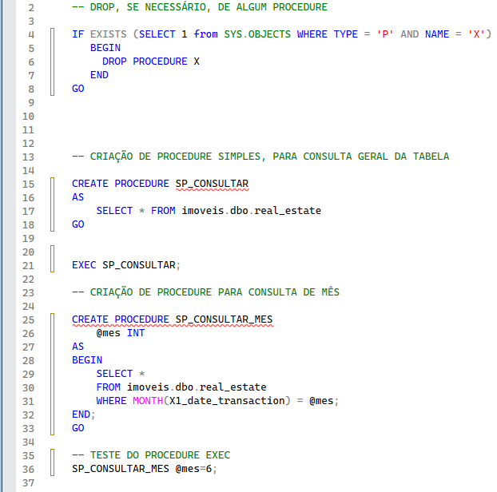
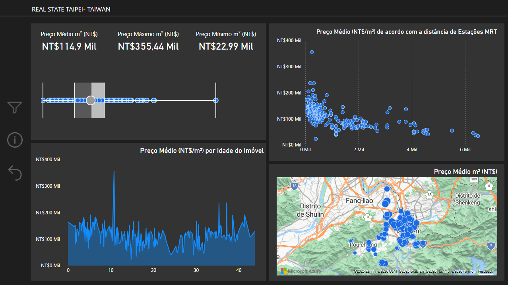

# 🏠 Real Estate Valuation — Análise de Dados (Taiwan)

Este repositório contém uma **análise exploratória do Real Estate Valuation Dataset (Taiwan)**, disponibilizado pela **UCI Machine Learning Repository**.  
O projeto tem como foco a **análise do mercado imobiliário**, utilizando **SQL Server** para criação de **functions, procedures e consultas analíticas**, além de **Power BI** para visualização dos dados.

O objetivo é compreender **fatores que influenciam o valor do metro quadrado dos imóveis**, como idade da propriedade, localização e proximidade a estações MRT.

## 📂 Estrutura do Repositório

- **images/**  
  Pasta destinada ao armazenamento de gráficos e capturas do dashboard.
  
- **Queries Imoveis.sql**  
  Scripts SQL contendo:
  - Criação de Views;
  - Criação de Funções (FUNCTIONS);
  - Criação de Procedures armazenadas (STORED PROCEDURES);
  - Consultas analíticas.

- **Dashboard_Real_Estate_Taiwan.pbix**  
  Dashboard interativo desenvolvido no Power BI.

- **README.md**  
  Documento com descrição, objetivos, estrutura e instruções do projeto.

## 🗄️ Análise de Dados com SQL Server

Parte da análise foi realizada diretamente no **SQL Server**, com foco em **simplicidade, e desempenho** na lógica SQL.

Foram desenvolvidos:

### Function
- Conversão do valor do imóvel para **NT$/m²**, garantindo padronização da métrica utilizada nas análises.

### ⚙️ Stored Procedures
- Procedure para consulta completa dos registros (`SELECT *`);
- Procedure para filtragem dos dados **por mês de venda dos imóveis**, facilitando análises temporais.

Exemplo de Procedures criados no SQL Server:

## 📊 Visualização no Power BI

O arquivo **Dashboard_Real_Estate_Taiwan.pbix** apresenta um dashboard interativo que permite:

- Analisar a distribuição do preço por metro quadrado;
- Avaliar a relação entre idade do imóvel e valorização;
- Comparar preços por localização geográfica;
- Identificar padrões relacionados à infraestrutura urbana;
- Explorar métricas dinâmicas calculadas via SQL.

Exemplo de visualizações presentes no dashboard:

## 🗂️ Fonte dos Dados

- **UCI Machine Learning Repository — Real Estate Valuation Dataset (Taiwan)**  
  Dataset público com dados reais do mercado imobiliário taiwanês.

  🔗 https://archive.ics.uci.edu/dataset/477/real+estate+valuation+data+set

## 🎯 Objetivos do Projeto

Este projeto tem como objetivos:

- Aplicar **Análise Exploratória de Dados** diretamente em SQL;
- Explorar um dataset público real do mercado imobiliário;
- Criar **dashboards interativos** no Power BI;
- Simular um cenário próximo ao uso profissional de dados em BI.

## 🚀 Tecnologias Utilizadas

- SQL Server  
- Stored Procedures & Functions  
- Power BI  
- Git & GitHub 
